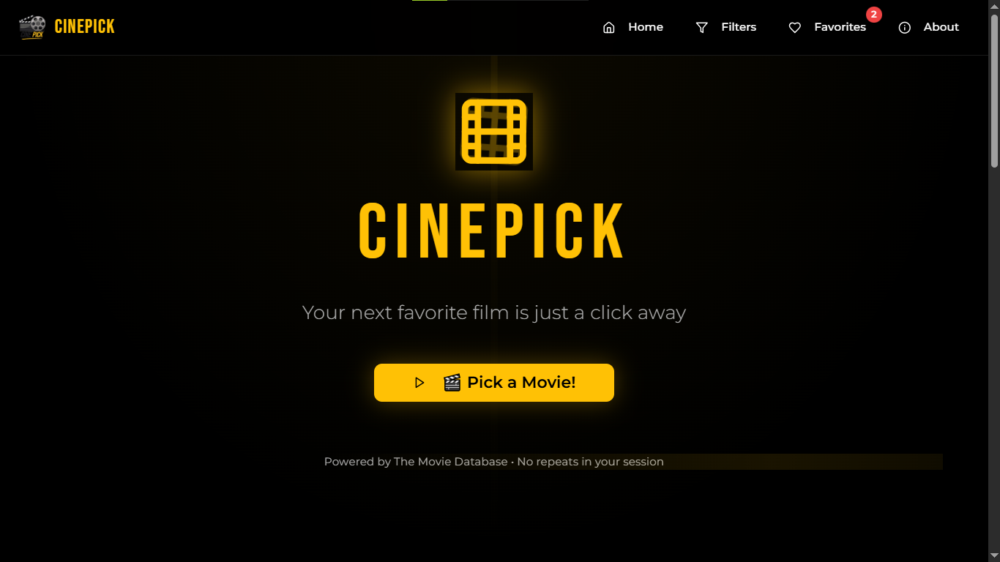

# 🎬 CinePick


CinePick is a yellow-and-black themed movie recommendation app powered by **The Movie Database (TMDb) API**.  
Say goodbye to endlessly browsing through lists — CinePick finds great movies for you with a single click.

---

## 🌟 Features

- 🎥 **Random Movie Discovery** – Find a surprise movie every time you visit.
- 🎨 **Cinematic UI** – Sleek black & yellow theme with clean typography.
- 📱 **Responsive** – Works perfectly on desktop, tablet, and mobile.
- 📄 **Detailed Info** – View poster, description, genres, runtime, ratings, and release date.
- ❤️ **Favorites** – Save movies you love to watch later.
- 🔍 **Filtering** – Filter by genre, year, or rating.

---

## 🖼 Preview


---

## 🛠 Tech Stack

- **Frontend:** HTML, CSS, JavaScript (React or Vanilla)
- **API:** [TMDb API](https://developer.themoviedb.org/)
- **Hosting:** Netlify / Vercel
- **Fonts:** [Bebas Neue](https://fonts.google.com/specimen/Bebas+Neue) for headings, [Poppins](https://fonts.google.com/specimen/Poppins) for UI.

---

## 🔑 Setup Instructions

1. **Clone the repository**
   ```bash
   git clone https://github.com/yourusername/cinepick.git
   cd cinepick
   ````

2. **Install dependencies** (if using React)

   ```bash
   npm install
   ```

3. **Get TMDb API Key**

   * Sign up at [The Movie Database](https://www.themoviedb.org/)
   * Go to settings → API → Generate key
   * Example:

     * `API Key` → `ef--------------57`
     * `Bearer Token` → `ey--------------3Y...`

4. **Create `.env` file**

   ```env
   REACT_APP_TMDB_API_KEY=ef----------------------57
   REACT_APP_TMDB_BEARER=ey----------------------------So
   ```

5. **Run the app locally**

   ```bash
   npm start
   ```

---

## 🚀 Deployment

Deploy easily to [Netlify](https://www.netlify.com/) or [Vercel](https://vercel.com/).

---

## 📜 License

This project is licensed under the MIT License.

---

## 💡 Acknowledgments

* **TMDb API** for movie data and posters.
* **Google Fonts** for typography.
* **Design inspiration** from SugoiPick & MeloPick for consistent branding.
